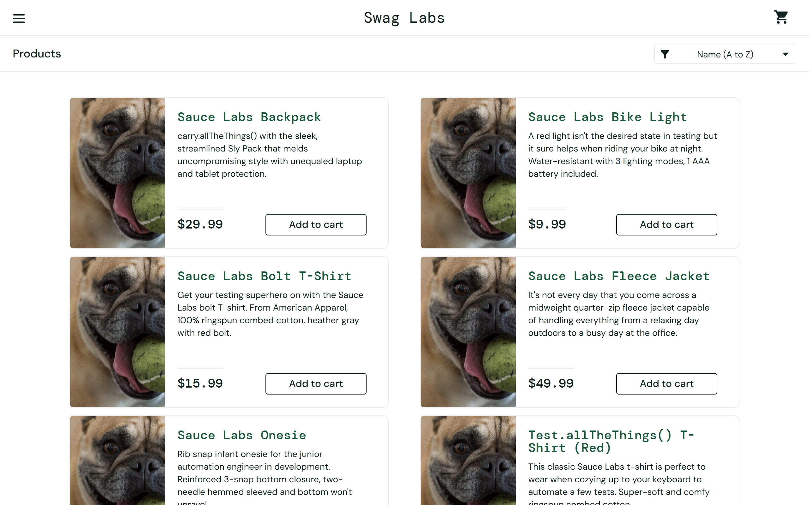
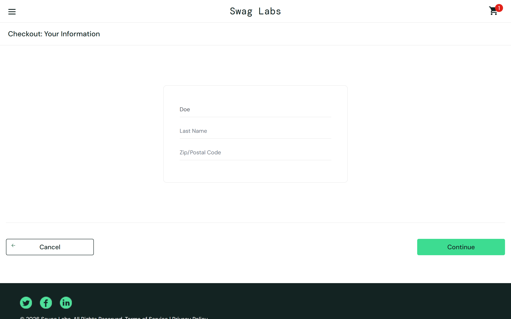

# Defect Log

SauceDemo deliberately serves broken builds of the store to the `problem_user`
and `error_user` accounts. This log documents the defects my regression suite
catches in those builds, written up the way I'd hand them to a development team.

Each bug is pinned by a test in [`tests/defects/test_known_defects.py`](tests/defects/test_known_defects.py),
marked `xfail(strict=True)`: the suite proves the bug exists on every CI run,
stays green while doing so, and fails loudly the day the bug is fixed so the
test can be promoted into the main regression suite.

Reproduce everything below with: `pytest -m defect`

---

## BUG-01: Every product shows the same broken image

| | |
|---|---|
| **Severity** | Major. Customers cannot see what they are buying |
| **Build** | `problem_user` |
| **Area** | Product listing |
| **Caught by** | `test_every_product_shows_its_own_image` |

**Steps to reproduce**
1. Log in as `problem_user`
2. Observe the product grid on the inventory page

**Expected:** each of the 6 products displays its own photo.
**Actual:** all 6 products render the identical broken-image placeholder (`sl-404` asset).

---

## BUG-02: Sorting by price silently does nothing

| | |
|---|---|
| **Severity** | Major. A core browsing feature fails with no error shown |
| **Build** | `problem_user` |
| **Area** | Product listing / sorting |
| **Caught by** | `test_price_sort_orders_products_low_to_high` |

**Steps to reproduce**
1. Log in as `problem_user`
2. Select "Price (low to high)" in the sort dropdown

**Expected:** products reorder from cheapest to most expensive.
**Actual:** the grid does not change; prices remain in default order
(`$29.99, $9.99, $15.99, $49.99, $7.99, $15.99`). The user gets no feedback
that sorting failed.

---

## BUG-03: Last Name input writes into the First Name field

| | |
|---|---|
| **Severity** | Critical. Blocks the purchase funnel |
| **Build** | `problem_user` |
| **Area** | Checkout, step one |
| **Caught by** | `test_checkout_form_keeps_first_and_last_name_distinct` |

**Steps to reproduce**
1. Log in as `problem_user`, add any item, proceed to checkout
2. Type "John" in First Name
3. Type "Doe" in Last Name

**Expected:** First Name holds "John", Last Name holds "Doe".
**Actual:** every keystroke in Last Name lands in the First Name field.
First Name ends up as "Doe" and Last Name stays empty. The form cannot be
filled correctly, so this build cannot take an order with accurate
customer data.

---

## BUG-04: "Add to cart" unresponsive for some products

| | |
|---|---|
| **Severity** | Critical. Directly lost revenue on affected products |
| **Build** | `problem_user` |
| **Area** | Product listing / cart |
| **Caught by** | `test_every_product_can_be_added_to_cart` |

**Steps to reproduce**
1. Log in as `problem_user`
2. Click "Add to cart" on *Sauce Labs Bolt T-Shirt* (also reproducible with *Sauce Labs Fleece Jacket*)

**Expected:** cart badge increments; button switches to "Remove".
**Actual:** nothing happens. No badge, no state change, no error.
**Related observation:** for products that *can* be added, the "Remove"
button on the grid is equally unresponsive (cart badge never decrements).

---

## BUG-05: Sorting raises an error for error_user

| | |
|---|---|
| **Severity** | Major. Feature broken, and the failure is user-visible |
| **Build** | `error_user` |
| **Area** | Product listing / sorting |
| **Caught by** | `test_price_sort_completes_without_error` |

**Steps to reproduce**
1. Log in as `error_user`
2. Select "Price (low to high)" in the sort dropdown

**Expected:** products reorder from cheapest to most expensive.
**Actual:** a browser dialog appears reading *"Sorting is broken! This error
has been reported to Backtrace."* and the grid stays unsorted.

---

## BUG-06: Orders cannot be completed, Finish button does nothing

| | |
|---|---|
| **Severity** | Blocker. No order can ever be placed on this build |
| **Build** | `error_user` |
| **Area** | Checkout, final step |
| **Caught by** | `test_order_can_be_completed` |

**Steps to reproduce**
1. Log in as `error_user`, add any item, complete checkout step one
2. On the order overview page, click **Finish**

**Expected:** order confirmation page ("Thank you for your order!").
**Actual:** the click is swallowed. The page stays on the order overview
with no confirmation and no error. The customer cannot finish paying.
**Related observation:** on this build the Last Name field also cannot be
typed into at all, yet checkout validation lets the empty value through,
which is a second, masked validation defect.
