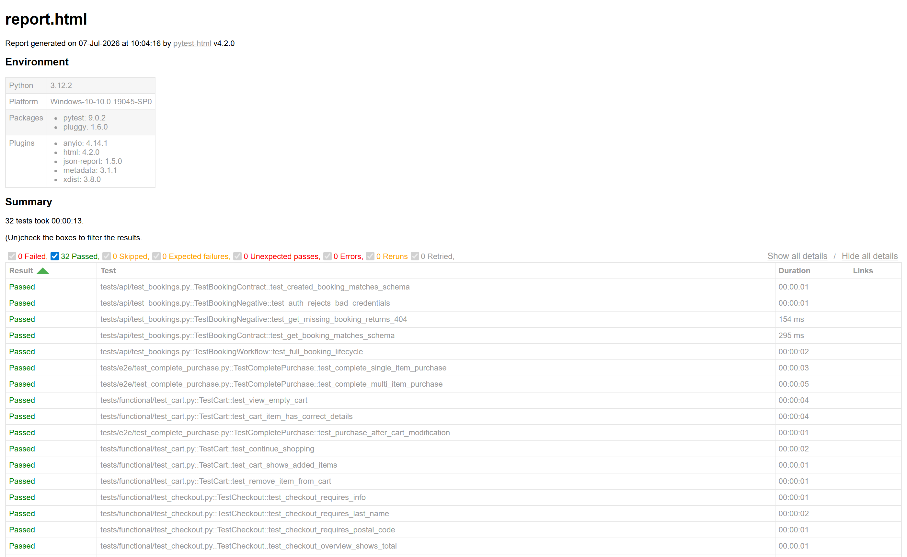
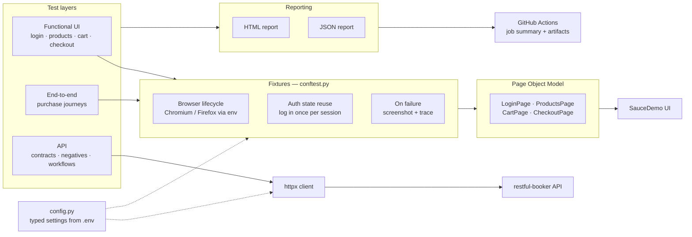

# E-Commerce Test Automation Framework

[](https://github.com/TheodorGit/playwright-test-framework/actions/workflows/tests.yml)


**Catches breaks in an e-commerce purchase funnel — login, cart, checkout, and backend API contracts — on two browsers with every push, with a full local regression run in about 15 seconds.**

Built with Python, Playwright and Pytest against public demo targets: the [SauceDemo](https://www.saucedemo.com/) storefront (UI) and the [restful-booker](https://restful-booker.herokuapp.com) API.



## What this demonstrates

| Capability | What it means for your project |
|---|---|
| **Page Object Model** with stable `data-test` locators | UI changes are cheap to absorb: update one page class, every test that uses it keeps working |
| **Auto-retrying `expect()` assertions — zero `sleep()`** | Tests fail when the product is broken, not when the network is slow |
| **Log in once, reuse auth state** | Authenticated tests skip the login form via Playwright storage state — that's how 32 tests finish in ~13 s |
| **Parallel execution** (pytest-xdist) | Regression feedback stays fast as the suite grows — one flag (`-n auto`) spreads tests across CPU cores |
| **API test layer** (httpx + JSON Schema) | Backend contract breaks caught in seconds, without launching a browser |
| **Failure artifacts: screenshot + Playwright trace** | Every red test ships with evidence — replay the exact failing moment step-by-step with `playwright show-trace` |
| **HTML + JSON reporting** | A report stakeholders can read, plus machine-readable output that plugs into any CI/CD dashboard |
| **GitHub Actions matrix** (Chromium + Firefox) | Cross-browser confidence on every push; reports attached to every run as downloadable artifacts |
| **Typed settings module**, all config via `.env` | Point the same suite at dev / staging / prod by changing an env file — no code edits, no hardcoded URLs or credentials |

## Architecture



## Quickstart

```bash
git clone https://github.com/TheodorGit/playwright-test-framework.git && cd playwright-test-framework
pip install -r requirements.txt && playwright install chromium
pytest -n auto
```

Defaults work out of the box (headless Chromium against SauceDemo). To customise, copy `.env.example` to `.env` and edit — target URL, credentials, browser, headless mode are all environment-driven via `config.py`.

## Running the suites

```bash
pytest -m smoke                  # critical paths only — login + a complete purchase
pytest -m regression -n auto     # full UI regression, parallelised
pytest -m api                    # API layer only, no browser required
pytest -m "not api" -n auto      # everything UI
BROWSER=firefox pytest -m smoke  # same tests, different engine
```

Generate the reports CI produces:

```bash
pytest -n auto --html=test_results/report.html --self-contained-html \
       --json-report --json-report-file=test_results/report.json
```

When a test fails, `test_results/` also receives a full-page screenshot and a Playwright trace (`playwright show-trace test_results/traces/<test>.zip`).

## Project structure

```
├── .github/workflows/tests.yml   # CI: Chromium + Firefox matrix, API job, report artifacts
├── config.py                     # Typed, frozen settings — the only place env vars are read
├── pages/                        # Page Object Model (BasePage + 4 page classes)
├── tests/
│   ├── conftest.py               # Browser lifecycle, auth-state reuse, failure artifacts
│   ├── functional/               # Login, products, cart, checkout
│   ├── e2e/                      # Complete purchase journeys
│   └── api/                      # Contract, negative and workflow tests (httpx + JSON Schema)
└── pytest.ini                    # Markers: smoke, regression, functional, e2e, api
```

## About me

**Theodor — QA Automation Engineer.** Python · Playwright · Pytest · Jenkins · SQL.
Beyond UI automation: API testing, load testing with Locust, and email deliverability (DMARC / DKIM / SPF, Google Postmaster Tools).

Find me on GitHub: [@TheodorGit](https://github.com/TheodorGit)
